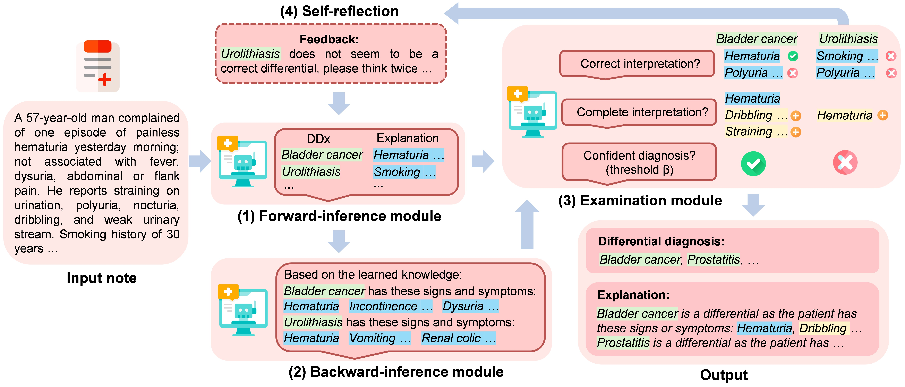

# Explainable Differential Diagnosis With Dual-Inference Large Language Models (Dual-Inf)

## 1. Introduction
This repository contains code for the paper "[Explainable Differential Diagnosis With Dual-Inference Large Language Models](https://www.nature.com/articles/s44401-025-00015-6)" (NPJ Health Systems 2025).


## 🔥🔥🔥 Highlight: Expert-Annotated Dataset for Differential Diagnosis 🔥🔥🔥

We have constructed an **expert-annotated dataset** specifically designed for differential diagnosis!


---

#### **Figure 1: Dual-Inference Model**



*An overview of the Dual-Inference Large Language Model framework (Dual-Inf) for interpretable
DDx. Dual-Inf consists of four components: (1) a forward-inference module, which is an LLM to generate
initial diagnoses from patient symptoms, (2) a backward-inference module, which is an LLM for conducting
inverse inference via recalling all the representative symptoms associated with the initial diagnoses, i.e., from
diagnoses to symptoms, (3) an examination module, which is another LLM to receive patients’ notes and the
output from the two modules for prediction assessment (e.g., completeness examination) and decision making
(e.g., filtering out low-confidence diagnoses), and (4) an iterative self-reflection mechanism, which iteratively
takes the low-confidence diagnoses as feedback for the forward-inference module to “think twice”.*

---

---


## 2. Usage
### Requirements:
+ openai==0.28.0
+ python==3.9.19
+ ast
+ pandas


### Our Annotated Datasets: Open-XDDx
The annotated dataset Open-XDDx is available in this repo. 
Each sample is annotated with a set of differential diagnoses (i.e., possible diseases) along with their corresponding diagnostic explanations.

---

#### **Figure 1: Open-XDDx Dataset**


*An example of the annotated data. It contains a set of differential diagnoses (i.e., possible diseases) and the corresponding evidence that supports the diagnosis.*

---


### Example:
Please modify the 'file_path' in the code to adapt to the path of your data folder.

+ python Code_Dual-Inf.py


## 3. Summary of Differential Diagnosis Datasets


### Open-XDDx  
*Journal:* NPJ Health Systems 2025

---

### DDXPlus: A New Dataset for Automatic Medical Diagnosis  
*Conference:* NIPS 2022  

---

### NEJM Case Records  
*Source:* New England Journal of Medicine (NEJM)


---

For research cooperation, please contact zhou2219 AT umn.edu


⭐️ If you find this project beneficial to your study, please give it a star!


## 4. Citation
Please kindly cite the paper if you use the code or any resources in this repo:

Zhou, S., Lin, M., Ding, S. et al. Explainable differential diagnosis with dual-inference large language models. npj Health Syst. 2, 12 (2025). https://doi.org/10.1038/s44401-025-00015-6

or

```bib
@article{zhou2025explainable,
  title={Explainable differential diagnosis with dual-inference large language models},
  author={Zhou, Shuang and Lin, Mingquan and Ding, Sirui and Wang, Jiashuo and Chen, Canyu and Melton, Genevieve B and Zou, James and Zhang, Rui},
  journal={npj Health Systems},
  volume={2},
  number={1},
  pages={12},
  year={2025},
  publisher={Nature Publishing Group UK London}
}
```

